# AREP-SparkDockerWebApp

## Resumen
El objetivo de este laboratorio es implementar un aplicativo web usando el framework de Spark para java, con la cual se construirá un contenedor docker para la aplicación y se configurará para nuestra máquina local.
Posteriormente crearemos un repositorio en DockerHub y subiremos la imagen al repositorio.
Finalmente crearemos una máquina virtual en AWS, instalaremos Docker y desplegaremos el contenedor creado anteriormente para poder utilizar el aplicativo web.

El aplicativo web cuenta con un balanceador de carga y tres nodos, el balanceador se encargará de enviar las peticiones a los distintos nodos mediante el algoritmo de balanceo de cargas de Round Robin.
Estos nodos se conectarán a una base de datos mongo para poder obtener los datos y retornarlos.

La arquitectura descrita anteriormente se puede ver en la siguiente imagen.

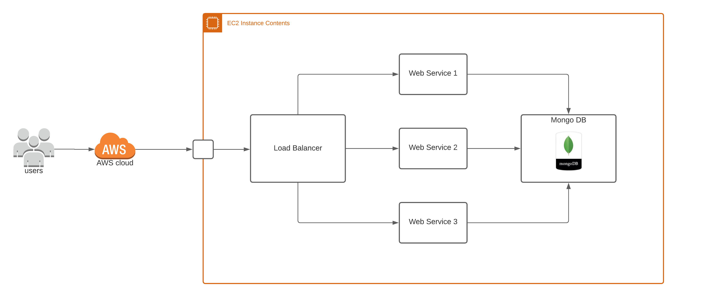

## LoadBalancer
El proyecto se encuentra disponible [aquí](https://github.com/JohannPaez/AREP-LoadBalancer-SparkDockerWebApp).
#### Integración Continua
[](https://circleci.com/gh/JohannPaez/AREP-LoadBalancer-SparkDockerWebApp)

## SparkWebApp
El proyecto se encuentra disponible [aquí](https://github.com/JohannPaez/AREP-SparkWebApp-SparkDockerWebApp).
#### Integración Continua
[](https://circleci.com/gh/JohannPaez/AREP-SparkWebApp-SparkDockerWebApp)

  ## Diseño
 Los detalles del diseño, la arquitectura del programa, problema, definiciones y pruebas se pueden encontrar en el siguiente documento [Artículo Sobre el Diseño](ArquitecturaDockerSparkWebApp.pdf).
   
 ## Prerequisitos
 Tener instalado:
 - Java.
 - Maven.
 - Docker.
 
 Entender sobre peticiones http, docker (contenedores), servidores y demás, así como el lenguaje JAVA en el que fue realizado este proyecto.
 
 ## Comandos 
  Para compilar y correr las pruebas: ```mvn package```
  
  Para ejecutar y utilizar los aplicativos: ```mvn exec:java -Dexec.mainClass="com.arep.SparkWebServer"```
  
  Para generar javadoc con maven: ```mvn javadoc:javadoc```
  
  Para generar javadoc de las pruebas: ```mvn javadoc:test-javadoc```
  
  **IMPORTANTE:** Para poder utilizar el aplicativo es necesario compilar primero el proyecto con **mvn package**.
 
 ## ¿Cómo usar el aplicativo?
 Descargue o clone el repositorio con el siguiente comando.
 
    git clone https://github.com/JohannPaez/AREP-SparkDockerWebApp.git
    
Acceda a los proyectos LoadBalancer y SparkWebApp y compile cada proyecto con el comando.

    mvn package

Luego acceda al directorio DockerCompose y ejecute el siguiente comando para crear los contenedores en docker y poder utilizar el aplicativo.

    docker-compose up -d --scale web=3

Una vez el proyecto termine de crearse, puede acceder al aplicativo web mediante http://localhost:10000/.       

**Importante**: Si sólo deseas utilizar el aplicativo, puedes hacerlo accediendo al siguiente enlace http://ec2-3-84-114-195.compute-1.amazonaws.com:10000/.

 ## Operaciones
 - **GET**: Permite realizar peticiones get definidas por el usuario como (retornar los mensajes en este caso).
 	- **/mensajes**: Es la operación encargada de dar todos los mensajes.
 - **POST**: Permite realizar peticiones post definidas por el usuario como (insertar un nuevo mensaje).
 	- **/addMensaje**: Es la operación encargada de añadir un nuevo mensaje.


## Pruebas
### Local
Aplicativo web funcionando correctamente en el puerto 10000 y contenido de los mensajes de la base de datos Mongo.

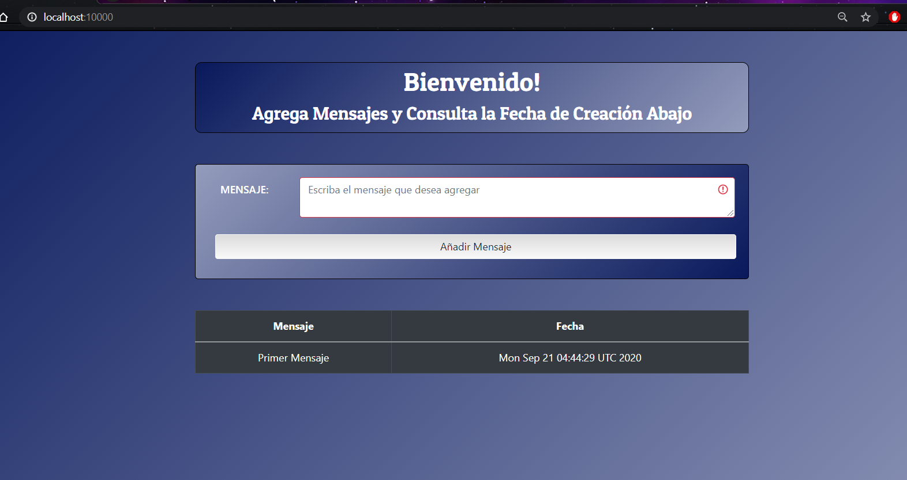

Agregar un nuevo mensaje a la base de datos mediante el aplicativo.

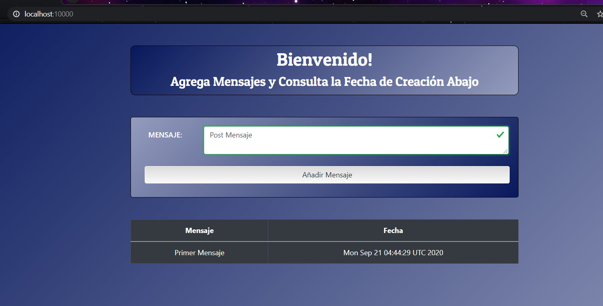

Mensaje agregado correctamente a la base de datos 

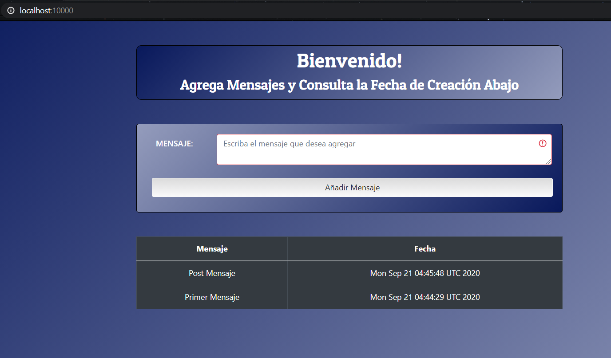

Contenido de la base de datos mediante el cliente Studio 3T.

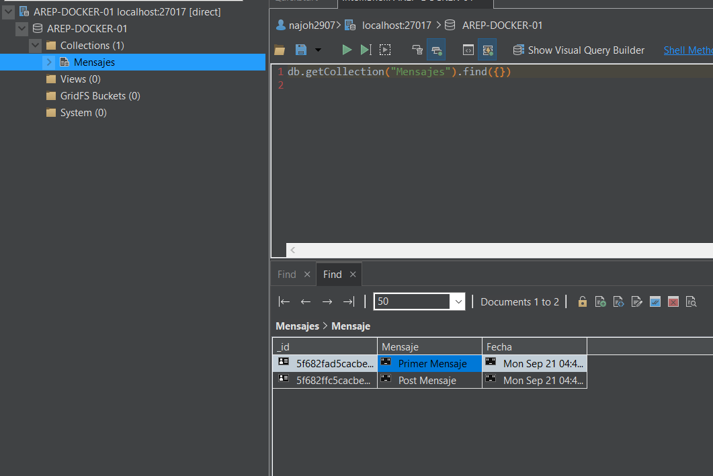

Petición Post al servidor web usando Curl para añadir un nuevo mensaje a la base de datos.

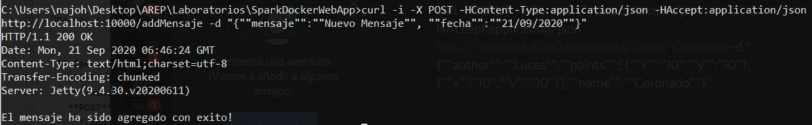

Petición Get al servidor web usando Curl para ver todos los mensajes de la base de datos.

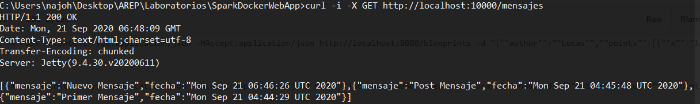

Logs del balanceador de carga al realizar las anteriores operaciones (se puede evidenciar el balanceo de cargas de Round Robin, delegando el procesamiento del mensaje).

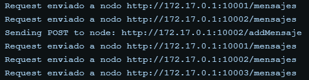

### AWS

Aplicativo web funcionando correctamente en AWS en el puerto 10000 y contenido de los mensajes de la base de datos Mongo.

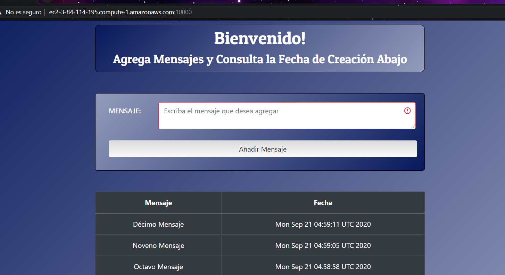

Logs del balanceador de carga de AWS (se puede evidenciar el balanceo de cargas de Round Robin, delegando el procesamiento del mensaje).

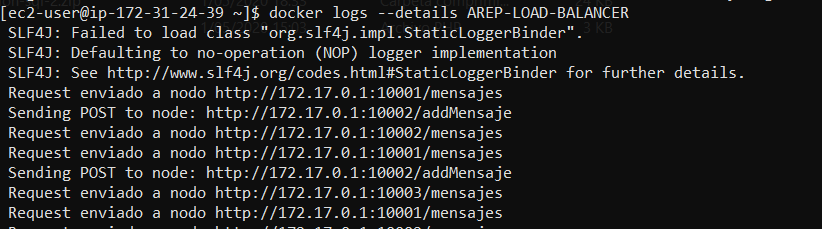

Contenido de la base de datos mediante el cliente Studio 3T.

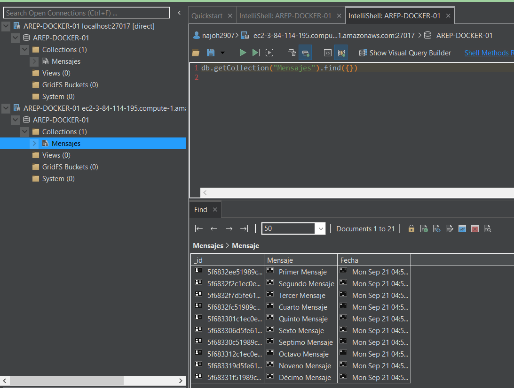

Petición Post al servidor web en AWS usando Curl para añadir un nuevo mensaje a la base de datos.

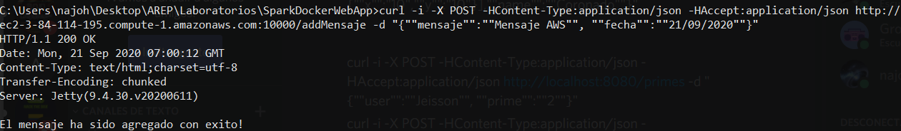

Petición Get al servidor web usando Curl para comprobar que el mensaje anterior se agrego correctamente.

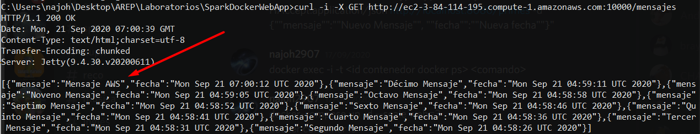

Contenido del aplicativo web después de realizar la petición Post mediante el curl.

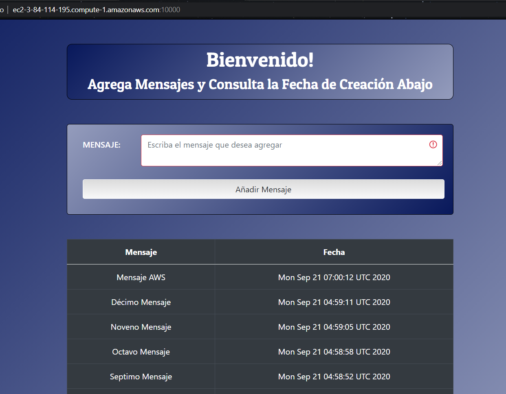


## Construido 
- [Eclipse](https://www.eclipse.org/) Editor de JAVA donde se puede compilar el proyecto.

- [Maven](https://maven.apache.org/) Administrador de dependencias.

- [Docker](https://www.docker.com/) Administrador de contenedores.

## Autor
**Johann Sebastian Páez Campos** - Trabajo Programación AREP-DockerSparkWebApp **21/09/2020**

## Licencia
Este programa es de uso libre, puede ser usado por cualquier persona.

Los terminos de la licencia se pueden encontrar en el siguiente archivo [License](LICENSE).
